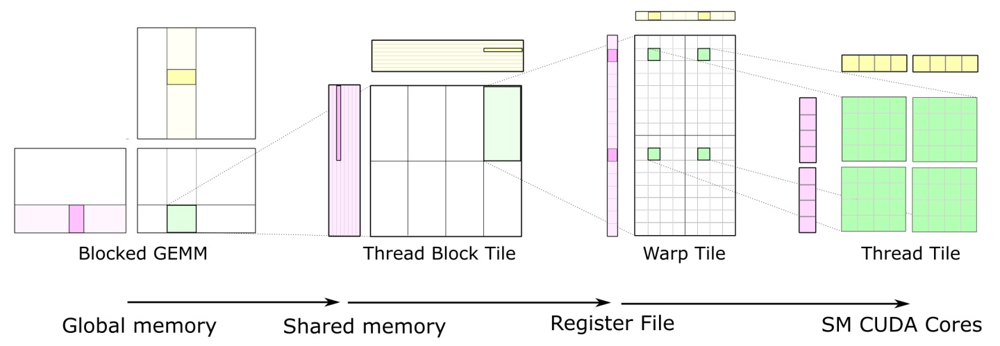

# CUDA Matrix Multiplication Step-by-Step

My rewrite version about how to optimize Matmul or GEMM from scratch.

$GEMM := C = \alpha AB + \beta C$

## Require
```
CUDA 10+
CMake 3.10+
```

## Usage

```bash
mkdir build && cd build
cmake .. && make -j6
./matmul 
```

## Result
```
GPU has cuda devices: 1
----device id: 0 info----
  GPU : NVIDIA GeForce RTX 3080 Ti 
  Compute Capbility: 8.6
  Memory Bus Width: 384
  ----------------
  Total Global memory: 12023MB
  Shared Memory Per Block: 48KB
  Shared Memory Per MultiProcessor: 100KB
  Total Constant Memory: 64KB
  ----------------
  Max Threads Per Block: 1024
  Max Regsters Per Block: 65536
  Total MultiProcessors: 80
  Max Threads Per MultiProcessor: 1536
  Max Regsters Per MultiProcessor: 65536
  ----------------
  Warp Size: 32
  grid dim: (2147483647,65535,65535)
  Max block dim: (1024,1024,64)
---------------------------

[kernel_1(Naive GEMM)]: Correct!
[kernel_2(Global Memory coalesce)]: Correct!
[kernel_3(Shared Memory + Global Memory Coalesce)]: Correct!
[kernel_4(Shared Memory + Global Memory Coalesce + Block Tiling 1D)]: Correct!
Warming up...
 --- GEMM Performance ---
1. Naive GEMM: 7.314894 ms
2. Global Memory coalesce: 0.961353 ms
3. Shared Memory + Global Memory Coalesce: 0.717404 ms
4. Shared Memory + Global Memory Coalesce + Block Tiling 1D: 0.302392 ms
```

# Reference
[1] cuda-cmake-gtest-gbench-starter. 
at: https://github.com/PhDP/cuda-cmake-gtest-gbench-starter.

[2] Matrix Multiplication CUDA. 
at: https://ecatue.gitlab.io/gpu2018/pages/Cookbook/matrix_multiplication_cuda.html#8.

[3] Optimizing Parallel Reduction in CUDA - Nvidia
at: https://developer.download.nvidia.com/assets/cuda/files/reduction.pdf

[4] How to Optimize a CUDA Matmul Kernel for cuBLAS-like Performance: a Worklog
at: https://siboehm.com/articles/22/CUDA-MMM
